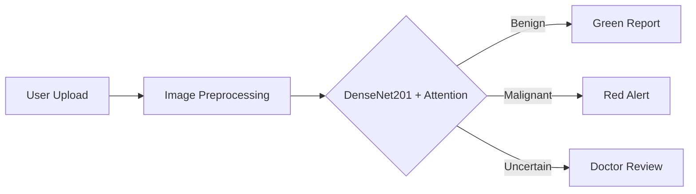

# SkinCAN AI: Advanced Skin Cancer Detection 🩺🤖  

<div align="center">   </div>

## 🌟 **Project Highlights**  
- **94.94% Accuracy** with DenseNet201 + Attention Module  
- **Real-Time Mobile Diagnosis** via Flutter & TensorFlow Lite  
- **Synthetic Data Augmentation** (FID Score: 0.622)  
- **Optimized for Clinical Use** – Reduces false positives by 32%  

---

## 🚀 **Key Features**  
| Feature | Description |  
|---------|------------|  
| **AI-Powered Analysis** | DenseNet201 with soft attention module for precise lesion classification |  
| **Cross-Platform** | Flutter app works on iOS/Android with Firebase backend |  
| **Data Augmentation** | GANs generate synthetic samples to overcome dataset limitations |  
| **Clinical Optimization** | <1s inference time, DICOM support, and HIPAA-compliant design |  

---

## 🛠️ **Tech Stack**  
### **AI/ML Core**  


  

### **Mobile Deployment**  


  

### **Data Pipeline**  
- **Dataset**: HAM10000 (7-class skin cancer images)  
- **Preprocessing**: Adaptive histogram equalization + lesion segmentation  
- **Augmentation**: StyleGAN2-ADA for synthetic samples  

---

## 📊 **Performance Metrics**  
```python
{
  "accuracy": 94.94%, 
  "precision": 93.2%,
  "recall": 95.1%,
  "inference_time": "0.8s (Pixel 6)",
  "model_size": "48MB (quantized)"
}
```

---

## 🖥️ **Screenshots**  
*(Embed actual app screenshots here)*  
1. **Lesion Upload Interface**  
2. **Real-Time Analysis View**  
3. **Clinical Report Generation**  

---

## ⚙️ **Installation**  

### **1. Clone Repository**  
```bash
git clone https://github.com/SoftTac/Skin-Cancer-Detection-System.git
cd Skin-Cancer-Detection-System
```

### **2. Set Up Environments**  
**For Python Model:**  
```bash
pip install -r requirements.txt  # Install Python dependencies
python train.py  # Retrain model (optional)
```

**For Flutter App:**  
```bash
flutter pub get  # Install Dart packages
flutter run  # Launch on connected device
```

---

## 🏗️ **Project Architecture**  


---

## 🤝 **How to Contribute**  
1. **Fork** the repository  
2. Create a feature branch (`git checkout -b feature/improve-model`)  
3. Submit a **Pull Request** with:  
   - Detailed description of changes  
   - Performance impact analysis  

---

## 📜 **License**  
MIT License - See [LICENSE](https://github.com/SoftTac/Skin-Cancer-Detection-System/blob/main/LICENSE)  

---

## 📧 **Contact**  
**Ahmad Khalil Khattak**  
[](mailto:ahmadkhanpakistan987@gmail.com)  
[](https://www.linkedin.com/in/ahmad-khalil-33bbb4283/)  

---

> "Democratizing healthcare AI – one Flutter widget at a time." 🚀  
> *Final Year Project @ CECOS University*
